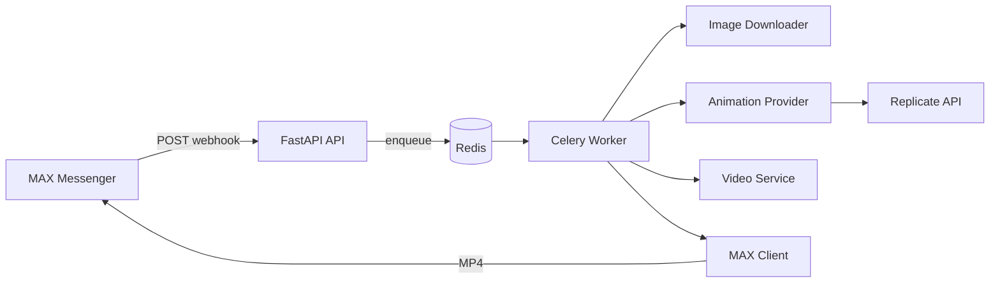

# MAX Portrait Animation Bot

Production-ready MVP бота для [MAX Messenger](https://dev.max.ru/docs-api), который анимирует портретные фото пользователей через [Replicate LivePortrait](https://replicate.com/fofr/live-portrait).

## Архитектура



**Слои:**

| Слой | Назначение |
|------|------------|
| `app/api` | Webhook, health, статус задач |
| `app/bot` | Парсинг MAX Update, постановка в очередь |
| `app/workers` | Celery: download → generate → postprocess → send |
| `app/providers` | Абстракция AI (Replicate / Fal / LivePortrait) |
| `app/services` | Downloader, MAX API, FFmpeg |

Webhook отвечает **сразу** (`200 OK`), тяжёлая работа — в Celery.

## Дерево проекта

```
project/
├── app/
│   ├── api/routes/       # health, webhook, tasks
│   ├── bot/              # parser, handlers
│   ├── workers/          # celery_app, tasks
│   ├── providers/        # base, replicate, fal, liveportrait
│   ├── services/         # downloader, max_client, video, pipeline
│   ├── models/
│   ├── schemas/
│   ├── utils/            # logging, exceptions, request context
│   ├── config/settings.py
│   └── main.py
├── assets/driving/       # smile.mp4, nod.mp4, hello.mp4
├── storage/
├── temp/
├── docker/Dockerfile
├── docker-compose.yml
├── scripts/download_driving_assets.py
├── requirements.txt
├── .env.example
└── README.md
```

## Требования

- Docker & Docker Compose
- Токен MAX бота ([business.max.ru](https://business.max.ru/self))
- Токен Replicate ([replicate.com/account/api-tokens](https://replicate.com/account/api-tokens))
- Публичный HTTPS URL для webhook (ngrok / cloud)

## Быстрый старт

### 1. Driving-видео (пресеты)

```bash
cd project
python scripts/download_driving_assets.py
```

Скачивает `smile.mp4`, `nod.mp4`, `hello.mp4` из репозитория LivePortrait.

### 2. Переменные окружения

```bash
cp .env.example .env
# Заполните MAX_BOT_TOKEN и REPLICATE_API_TOKEN
```

### 3. Docker

```bash
docker compose up --build
```

Сервисы:

- **api** — `http://localhost:8000`
- **worker** — Celery
- **redis** — брокер и result backend

### 4. Webhook в MAX

```bash
curl -X POST "https://platform-api.max.ru/subscriptions" \
  -H "Authorization: YOUR_MAX_BOT_TOKEN" \
  -H "Content-Type: application/json" \
  -d '{
    "url": "https://your-domain.com/webhook/max",
    "update_types": ["message_created"],
    "secret": "your_webhook_secret"
  }'
```

Укажите тот же `secret` в `.env` как `MAX_WEBHOOK_SECRET`.

Заголовок проверки: `X-Max-Bot-Api-Secret`.

## API

| Метод | Путь | Описание |
|-------|------|----------|
| GET | `/health` | Healthcheck (+ Redis ping) |
| POST | `/webhook/max` | Webhook MAX |
| GET | `/tasks/{task_id}` | Статус Celery-задачи |

### Webhook

Принимает объект `Update` (см. [документацию MAX](https://dev.max.ru/docs-api/objects/Update)).

При `message_created` с вложением `image`:

1. Извлекается `payload.url`
2. Пользователю отправляется подтверждение
3. Задача ставится в Celery
4. Ответ: `{"ok": true, "task_id": "..."}`

### Пресеты

Текст в подписи к фото или отдельным сообщением:

- `smile`, `nod`, `hello`
- `/preset smile` или `preset:nod`

По умолчанию: `DEFAULT_PRESET=smile`.

## Локальная разработка

```bash
python -m venv .venv
.venv\Scripts\activate   # Windows
pip install -r requirements.txt
python scripts/download_driving_assets.py

# Терминал 1 — Redis
docker run -p 6379:6379 redis:7-alpine

# Терминал 2 — API
set PYTHONPATH=.
uvicorn app.main:app --reload --port 8000

# Терминал 3 — Worker
celery -A app.workers.celery_app worker --loglevel=info
```

Туннель для webhook:

```bash
ngrok http 8000
```

## Replicate

- Модель: `fofr/live-portrait` (настраивается через `REPLICATE_MODEL`)
- Входы: `face_image`, `driving_video` + параметры пресета
- Провайдер: polling prediction, скачивание MP4/кадров

Смена провайдера без изменения бизнес-логики:

```env
ANIMATION_PROVIDER=replicate   # fal | liveportrait (заглушки)
```

Реализация нового провайдера: наследовать `AnimationProvider` в `app/providers/` и зарегистрировать в `factory.py`.

## Обработка ошибок

| Код | Ситуация |
|-----|----------|
| `invalid_image` | Битое/маленькое изображение |
| `no_face_detected` | Replicate не нашёл лицо |
| `file_too_large` | > `MAX_IMAGE_BYTES` |
| `unsupported_format` | Неверный MIME |
| `provider_timeout` | Таймаут Replicate |
| `generation_failed` | Ошибка модели |
| `max_api_error` | Сбой MAX API |

Пользователю отправляется понятное сообщение на русском.

## Логирование

JSON-логи в stdout с полями `request_id`, `task_id`, `level`, `timestamp`.

## Тестирование webhook (локально)

```bash
curl -X POST http://localhost:8000/webhook/max \
  -H "Content-Type: application/json" \
  -H "X-Max-Bot-Api-Secret: your_secret" \
  -d '{
    "update_type": "message_created",
    "timestamp": 1739184000000,
    "message": {
      "sender": {"user_id": 123, "is_bot": false, "name": "Test"},
      "recipient": {"chat_id": 1, "chat_type": "dialog", "user_id": 123},
      "body": {
        "mid": "mid.test",
        "text": "smile",
        "attachments": [{
          "type": "image",
          "payload": {"url": "https://upload.wikimedia.org/wikipedia/commons/thumb/3/3a/Cat03.jpg/1200px-Cat03.jpg"}
        }]
      }
    }
  }'
```

Проверка статуса:

```bash
curl http://localhost:8000/tasks/<task_id>
```

## Лицензия модели

LivePortrait на Replicate использует InsightFace и **не предназначен для коммерческого использования**. См. [readme модели](https://replicate.com/fofr/live-portrait/readme).
